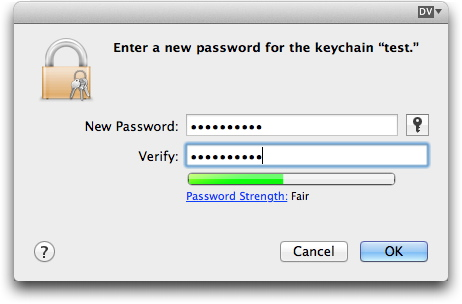
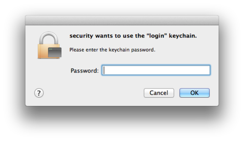

# keychain-creds

Unlock a keychain and get key values from within. Useful for basic authentication of API calls, especially if you have a large number of different API users to handle, for instance when dealing with multiple web contexts.

# Use 

There are two ways to use the `keychain-creds.sh` script or its contents.

* Copy the functions from this script into an existing bash script and put `$(get_api_creds KEYNAME)` in place of your hard-coded credentials (where `KEYNAME` is the name of the key you want from your keychain).  
* Source this script from your existing script with `. /path/to/keychain-creds.sh`.

The script expects `$API_KEYCHAIN_PASS` to exist in its environment. This is the password to unlock the keychain specified in `keychain-creds.sh`. If it doesn't exist, it will prompt to source the file `set-credentials.sh`. 

Running `set-credentials.sh` will prompt you to enter the password of the keychain, and will export `$API_KEYCHAIN_PASS` into the shell environment. You can then re-run `keychain-creds.sh`. 

If you are using a continuous integration tool such as Jenkins, you can instead supply `$API_KEYCHAIN_PASS` from your build.

# Prerequisites 

You need a keychain! You *could* add keys to your login or iCloud keychain. But if you wish to use version control, create a new keychain with its own password. 

To do this, open The Keychain Access application, then choose `File > New Keychain`. The application will ask you to name the keychain - you could use your user name or any other name - and then a password. 

Also, each key in the keychain that you wish to use needs to be approved for the `security` command one time via popup dialogue. This will occur the first time you run the script, and only needs to be done once, even if you copy the keychain to another device.

The path to the keychain is defined in `keychain-creds.sh`.

If sourcing the script, add the key names into the `keynames` list.